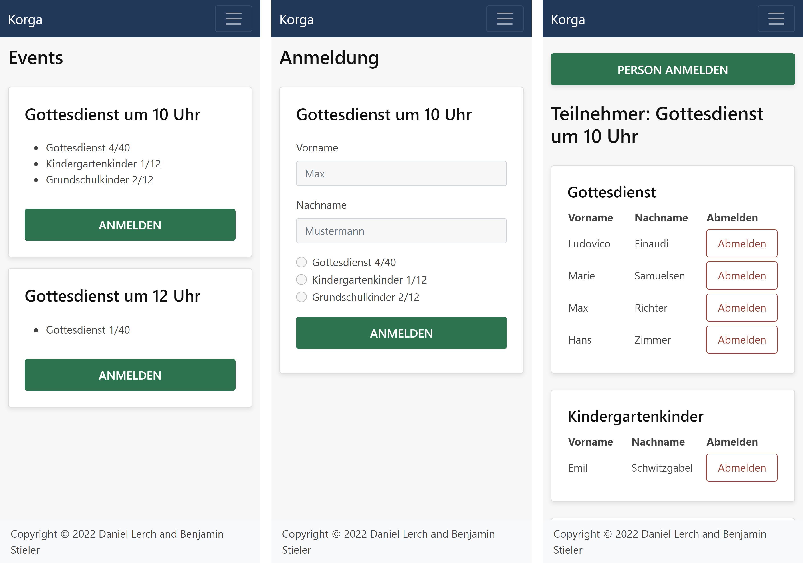

# Korga


[](https://hub.docker.com/r/daniellerch/korga)
[](https://hub.docker.com/r/daniellerch/korga)

Korga stands for the german term _**K**irchen **Orga**nisation_ (church organization).
It synchronizes people and groups with [ChurchTools](https://church.tools) and provides specialized features like email distribution lists.

## What can Korga already do?

### Email distribution lists

Once configured, Korga automatically synchronizes people and groups from ChurchTools. This data can be used to create distribution lists.

```
./Korga.Server distribution-list create --group 137 kids
```

This command creates a distribution list _kids@example.org_ which forwards emails to every member of group #137.

### Event registration



An event registration with multiple programs for each event. The list of participants is public as well as the possibility to delete registrations.

Currently, there is neither an API endpoint nor a graphical user interface available to edit events and programs. Instead you have to write SQL queries.

## Installation

The only officially supported distribution are Docker containers. An official image is available at [daniellerch/korga](https://hub.docker.com/r/daniellerch/korga).
If you are using Docker Compose, take a look our example compose file in the `docs` folder.

When you start Korga for the first time you have create the database schema via CLI:

```
docker compose exec app bash
./Korga.Server database migrate
```

Configuration for ChurchTools synchronization, IMAP, SMTP, etc. can set as enviroment variables.
See [appsettings.json](server/src/Korga.Server/appsettings.json) for an overview of available options and their default values.

## Contributing

Contributions are highly welcome. Please open an issue before implementing a feature to discuss your plans.

Korga's source code is split into the backend (located in `server`) and the frontend (located in `webapp`).
The following instructions are written for Windows but generally also apply to Linux development setups.

### Backend
- Visual Studio 2022
- .NET SDK 7.0
- MySQL or MariaDB _(e.g. from [PSModules](https://github.com/daniel-lerch/psmodules))_
- OpenLDAP server

### Frontend
- Visual Studio Code
- Vue Language Features (Volar) Extension
- NodeJS 18 LTS

During development the frontend running on the Vue CLI development server will use _http://localhost:50805_ as API endpoint.
That means the backend can be running in Visual Studio with Debugger attached.

If you just want to work on the frontend you can also use a public test server by creating a file `webapp/.env.development.local`
to override the defaults with `VUE_APP_API_URL=https://lerchen.net/korga`.
Then you don't have to setup a database server, LDAP server and the ASP.NET Core backend.
