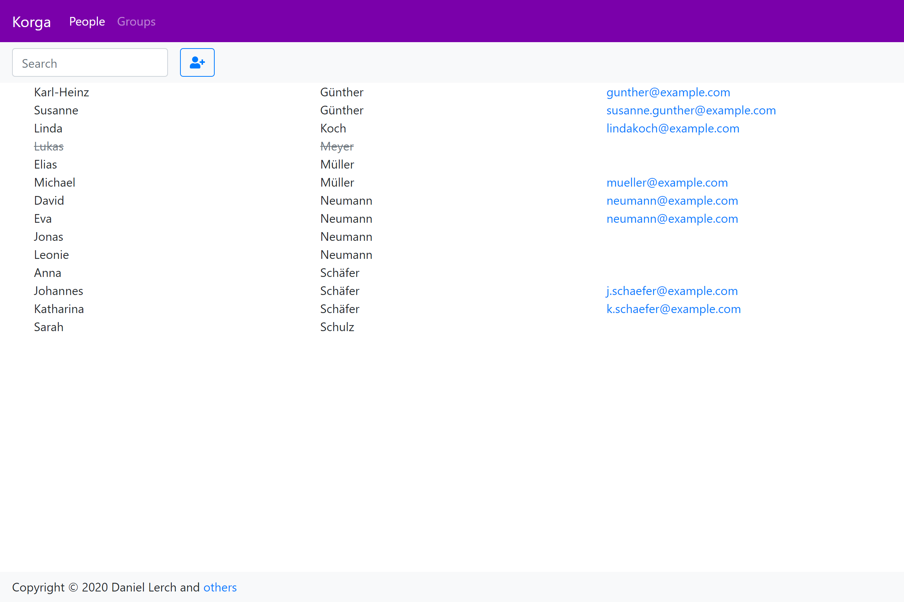
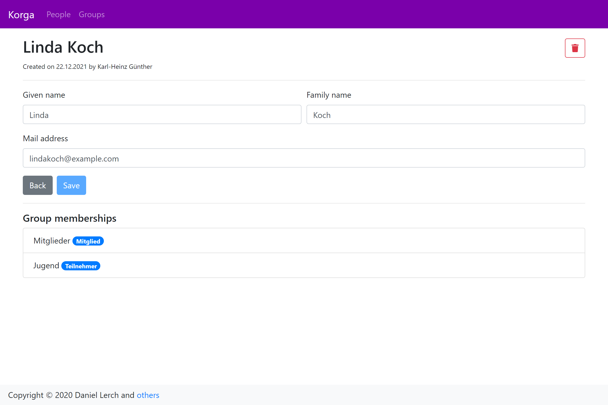
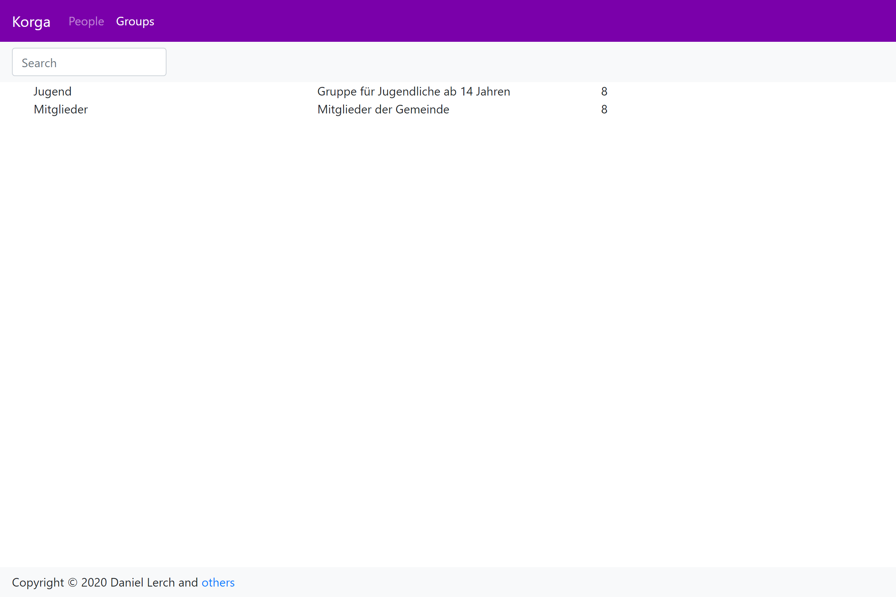

# Korga

> ⚠ This project as a standalone church management system has been discontinued.

## What was Korga planned to be?

Korga stands for the german term _**K**irchen **Orga**nisation_ (church organization).
Unlike all other church management systems known to the author, Korga is not designed to be an all-in-one solution for churches.
It is rather the link between several open source applications, while it itself only provides church-specific functionality.

| Feature | Applications |
|---|---|
| Account management | OpenLDAP,<br>Korga (OpenID Connect) |
| People, Groups, Mailing lists | Korga |
| File sharing | Nextcloud,<br>ownCloud |
| Chat | Synapse (Matrix),<br>Rocket.Chat,<br>Nextcloud Talk |
| Website | WordPress |

### Competitors

There are many interesting church management applications out there. These ones are known to the author of this project and might be interesting for you, too.

| Name | License | On-Prem | SaaS |
|---|---|---|---|
| Korga | AGPL-3.0 | ✔ | ❌ |
| [OpenKool](https://github.com/daniel-lerch/openkool) | GPL-2.0 | ✔ | ❌ |
| [kOOL](https://churchtool.org) | GPL-2.0 | ✔ | ✔<sup>1</sup> |
| [ChurchCRM](http://www.churchcrm.io) | MIT | ✔ | ❌ |
| [Rock](https://www.rockrms.com) | free software<sup>2</sup> | ✔ | ❌<sup>3</sup> |
| [Church Tools](https://www.church.tools) | proprietary | ✔ | ✔ |
| [Planning Center](https://www.planningcenter.com) | proprietary | ❌ | ✔ |

<sup>1</sup> Only for non-EU customers.  
<sup>2</sup> [Rock Community License](https://www.rockrms.com/license) similar to GPL.  
<sup>3</sup> In private beta as of December 2020.

## Screenshots


Korga's people view


Editing a person in Korga


Korga's groups view

## Installation

The only officially supported distribution are Docker containers. As there have not been releases so far you have to build the container locally:

```
$ docker build -t daniel-lerch/korga https://github.com/daniel-lerch/korga.git
```

If you are using Docker Compose, take a look our example compose file in the `docs` folder.

## Contributing

Contributions are highly welcome. Please open an issue before implementing a feature to discuss your plans.

Korga's source code is split into the backend (located in `server`) and the frontend (located in `webapp`).
The following instructions are written for Windows but generally also apply to Linux development setups.

### Backend
- Visual Studio 2019
- .NET SDK 5.0
- MySQL or MariaDB _(e.g. from [PSModules](https://github.com/daniel-lerch/psmodules))_
- OpenLDAP server

### Frontend
- Visual Studio Code
- Vetur Extension
- NodeJS 14 LTS

During development the frontend running on the Vue CLI development server will use _http://localhost:50805_ as API endpoint.
That means the backend can be running in Visual Studio with Debugger attached.

If you just want to work on the frontend you can also use a public test server by creating a file `webapp/.env.development.local`
to override the defaults with `VUE_APP_API_URL=https://lerchen.net/korga`.
Then you don't have to setup a database server, LDAP server and the ASP.NET Core backend.

## Roadmap

Person API
- [x] List
- [x] Details
- [x] Create
- [x] Modify
- [x] Delete
- [ ] Avatar
- [ ] Profile image
- [ ] LDAP person integration

Group API
- [x] List
- [x] Details
- [ ] Create
- [ ] Modify
- [ ] Delete
- [ ] LDAP group integration

Documentation
- [ ] Setup guide
- [ ] User guide 
- ...

Server
- [x] Basic database model
- [x] Changelog for important entities
- [ ] LDAP integration
- [ ] Permission model
- [ ] Identity provider
- [ ] Mailing lists
- [ ] Single sign on for external applications
- [ ] Bridges to popular messaging networks
- ...

Client
- [x] People view
- [ ] Group view
- [ ] Advanced filters
- [ ] Design concept
- [ ] Login
- [ ] PWA support
- ...
